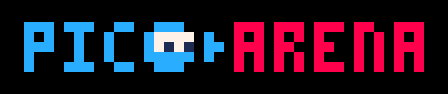

Enter the arena and test your skills! Pico Arena is a 2 player, top-down combat arena built with [Pico-8](https://www.lexaloffle.com/pico-8.php).

## Controls

- `up/down/left/right`: move
- `x`: shoot
- `o`: shield
- `o + direction`: dash attack
- `o + x`: shield burst

## Weapons

- `line`: hitscan weapon that does 1 dmg and 1 tile of knockback
- `cube`: projectile weapon with an area of effect damage and knockback
  + projectile will explode on impact, or can be exploded at any time by pressing x
  + be careful not to hurt yourself with this weapon

## Rock, Paper, Scissor Mechanic

- shield beats line (if player 1 shoots player 2 while shielded, attack is reflected and player 1 takes damage)
- dash beats shield (if player 1 is shielded and player 2 dash attacks, player 1 takes damage)
- line beats dash (if player 1 is dashing and player 2 shoots, dash is cancelled and player 1 takes damage)

## Dev Notes

This is my first Pico-8 game, and I had a blast making it. I quickly filled up the 8k token limit and was disappointed because there is so much more I wanted to add. I know I could play the token optimization game with Pico-8's token rules (strings are one token), but I wanted to keep the code human-readable. I will likely port to Löve2D to flesh out the game fully.

One cool thing I did in the code was to implement full integration tests. I instrumented the input function to enable a test to control input on a per frame level. This was super helpful in development, enabling test driven development, especially for frame-perfect scenarios that are difficult to test manually. Combined with Pico-8's built-in video recording, each test run output a gif where I can step through frame by frame to observe behavior. For fun I created a large `mosaic.gif` file of every test gif I created in the course of development, that shows the progression of each mechanic as I implemented them.

The code is all here: https://github.com/robcmills/pico-arena
